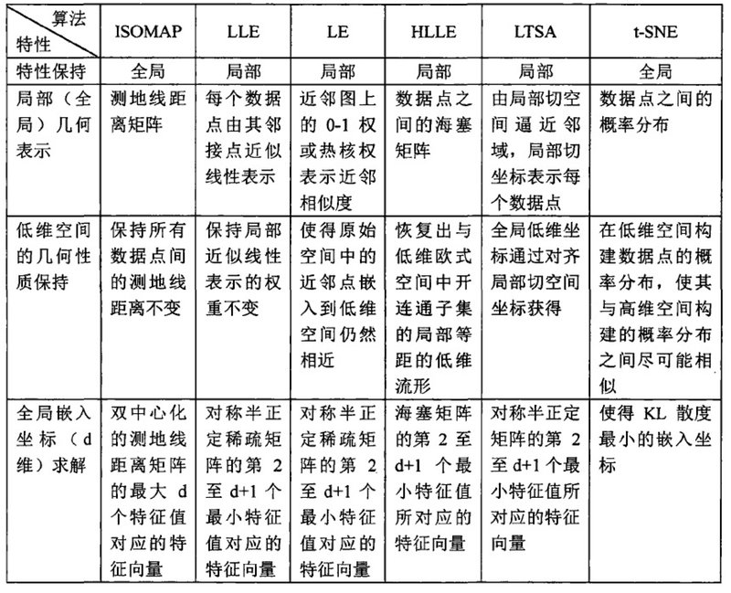

# 浅谈流形学习

“云行雨施，品物流形”，这是儒家经典《易经》对万物流变的描述。两千多年之后，“流形”一词被数学家借鉴，用于命名与欧几里得空间局部同胚的拓扑空间。

---

# 什么是流形学习?

流形学习（Manifold Learning）是一种处理高维数据的降维技术，它的核心思想是将高维数据映射到低维空间，同时尽量保持数据的原始结构和模式。这种方法的关键在于假设高维数据实际上是分布在低维流形上的，而流形学习的目标就是找到这个低维流形并实现数据的有效映射和降维。

流形学习的核心概念包括流形、拓扑保持、高维数据和降维技术。流形是一种抽象的几何结构，可以视为高维空间中的“曲面”，其上的数据点通过连续的曲线相互连接，并保持原始的拓扑特征。拓扑保持是指在降维过程中，数据点之间的拓扑关系应尽可能保持不变，这对于挖掘高维数据中的隐藏模式和结构至关重要。

流形学习的方法可以分为线性和非线性两大类。

1. 线性方法: 主成分分析（PCA）和线性判别分析（LDA）等
2. 线性方法: 等距映射（Isomap）、局部线性嵌入（LLE）、拉普拉斯特征映射（LE）等 。
3. 虽然流形这个词本身有着浓厚的学院派味道，但它的思想你却一点儿不会陌生。最著名的流形模型恐怕非瑞士卷（Swiss roll）莫属。

如图所示的瑞士卷是常见的糕点，只是它的名字未必像它的形状一样广为人知。瑞士卷实际上是一张卷起来的薄蛋糕片，虽然卷曲的操作将它从二维形状升级成了三维形状，但这个多出来的空间维度并没有产生关于原始结构的新信息，所以瑞士卷实际上就是嵌入三维空间的二维流形。

姑且把它看作一块卷起来的布好了。图中两个标黑圈的点，如果通过外围欧氏空间中的欧氏距离来计算的话，会是挨得很近的点，可是在流形上它们实际上是距离很远的点：红色的线是 Isomap 求出来的流形上的距离。可以想像，如果是原始的 MDS 的话，降维之后肯定会是很暴力地直接把它投影到二维空间中，完全无视流形结构，而 Isomap 则可以成功地将流形“展开”之后再做投影。

如果我们观察到的数据是三维的，但其本质是一个二维流形。图上所标注的两个圈圈，在流形（把卷展开）上本距离非常远，但是用三维空间的欧氏距离来计算则它们的距离要近得多。

在确定流形结构时，多维缩放让高维空间上的样本之间的距离在低维空间上尽可能得以保持，以距离重建误差的最小化为原则计算所有数据点两两之间的距离矩阵。根据降维前后距离保持不变的特点，距离矩阵又可以转化为内积矩阵。利用和主成分分析类似的方法可以从高维空间上的内积矩阵构造出从低维空间到高维空间的嵌入。

可是，原始高维空间与约化低维空间距离的等效性是不是一个合理的假设呢？想象一下你手边有个地球仪，这个三维的球体实际上也是由二维的世界地图卷成，因而可以约化成一个二维的流形。如果要在流形上计算北京和纽约两个城市的距离，就要在地球仪上勾出两点之间的“直线”，也就是沿着地球表面计算出的两个城市之间的直线距离。但需要注意的是，这条地图上的直线在二维流形上是体现为曲线的。

这样计算出的流形上的距离是否等于三维空间中的距离呢？答案是否定的。北京和纽约两点在三维空间中的欧氏距离对应的是三维空间中的直线，而这条直线位于地球仪的内部——按照这种理解距离的方式，从北京去纽约应该坐一趟穿越地心的直达地铁。这说明多维缩放方法虽然考虑了距离的等效性，却没能将这种等效性放在数据特殊结构的背景下去考虑。它忽略了高维空间中的直线距离在低维空间上不可到达的问题，得到的结果也就难以真实反映数据的特征。

吸取了多维缩放的经验教训，美国斯坦福大学的约书亚·泰宁鲍姆（Joshua Tenenbaum）等人提出了等度量映射的非线性降维方法。**等度量映射**（isometric mapping）以数据所在的低维流形与欧氏空间子集的等距性为基础。在流形上，描述距离的指标是**测地距离**（geodesic distance），它就是在地图上连接北京和纽约那条直线的距离，也就是流形上两点之间的固有距离。

在流形结构和维度未知的前提下，测地距离是没法直接计算的。等度量映射对这个问题的解决方法是利用流形与欧氏空间局部同胚的性质，根据欧氏距离为每个点找到近邻点（neighbors），直接用欧氏距离来近似近邻点之间的测地距离。

在这种方法中，测地距离的计算就像是奥运火炬，在每一个火炬手，也就是每一个近邻点之间传递。将每个火炬手所走过的路程，也就是每两个近邻点之间的欧氏距离求和，得到的就是测地距离的近似。

在每一组近邻点之间建立连接就可以让所有数据点共同构成一张带权重的近邻连接图。在这张图上，相距较远的两点的测地距离就被等效为连接这两点的最短路径，这个问题可以使用图论和网络科学中发展非常成熟的**Dijkstra算法**来求解。计算出距离矩阵后，等度量映射的运算和多维缩放就完全一致了。

等距离映射原理示意图

图A表示测地距离与欧氏距离的区别，图B表示利用近邻点近似计算测地距离，图C表示真实测地距离与近似测地距离的比较

等度量映射关注的是全局意义上数据的几何结构，如果只关注数据在某些局部上的结构，其对应的方法就是局部线性嵌入。

**局部线性嵌入**（locally linear embedding）由伦敦大学学院的萨姆·洛维思（Sam Roweis）等人提出，其核心思想是待求解的低维流形在局部上是线性的，每个数据点都可以表示成近邻点的线性组合。求解流形的降维过程就是在保持每个邻域中的线性系数不变的基础上重构原数据点，使重构误差最小。

局部线性嵌入的实现包括两个步骤：在确定一个数据点的近邻点后，首先根据最小均方误差来计算用近邻点表示数据点的最优权值，需要注意的是所有权值之和是等于1的；接下来就要根据计算出的权值来重构原数据点在低维空间上的表示，其准则是重构的近邻点在已知权值下的线性组合与重构数据点具有最小均方误差。对重构映射的求解最终也可以转化为矩阵的特征值求解。

局部线性嵌入原理示意图

图A表示为数据点 \\(X_i\\) 选择近邻点，图B表示将\\(X_i\\)表示为近邻点的线性组合并计算系数\\\(W_{i}\\)，图C表示保持\\(W_{i}\\)不变重构数据点\\(Y_i\\)

将两种典型的流形学习算法加以比较，不难发现它们的区别在于对流形与欧氏空间关系的理解上。流形与欧氏空间就像两个平行世界，将它们联系起来的羁绊是拓扑性质的保持。

等度量映射理如其名，它将距离视为空间变换过程中的不变量，强调的是不同数据点关系的不变性，以及数据全局结构的完整保持。打个比方，如果把全局结构看作一个拼图玩具，等度量映射的任务就是将每一块拼图所代表的邻域正确组合，从而构成完美的完整图案。

相比之下，局部线性嵌入在乎的只有数据关系在某个邻域上的不变性。数据点可以用它的邻近点在最小二乘意义下最优的线性组合表示，这个局部几何性质是不会改变的。可是在邻域之外，局部线性嵌入并不考虑相距较远的数据点之间关系的保持，颇有些“各人自扫门前雪，莫管他人瓦上霜”的意味。显然，局部线性嵌入在拼图时更加随意，只要把所有的拼图块按嵌入关系连成一片就可以了，至于拼出什么奇形怪状都不在话下。

基于全局信息的等度量映射（左）和基于局部信息的局部线性嵌入（右）

不管是等度量映射还是局部线性嵌入，都以几何性质作为同构的基础。如果要从概率角度理解流形学习，最具代表性的例子非随机近邻嵌入莫属。**随机近邻嵌入**（stochastic neighbor embedding）的核心特点是保持降维前后数据的概率分布不变，它将高维空间上数据点之间的欧氏距离转化为服从正态分布的条件概率

$$
p_{j | i} = \dfrac{\exp (- || x_i - x_j || ^ 2 / 2 \sigma_i^2)}{\sum_{k \ne i} \exp (- || x_i - x_j || ^ 2 / 2 \sigma_i^2)}
$$

上式中的\\(\sigma_i\\)是困惑度参数（perplexity），可以近似地看成近邻点的数目。这个概率表达式来描述不同数据点之间的相似性。简单地说，相距越近的点形成近邻的概率越大，相似的概率也就越大。这就像我们在上学时按照身高排队一样，站在一起的人身高会更加接近，位于队首和队尾两个极端的人则会有较大的身高差。

映射到低维空间后，随机近邻嵌入按照和高维空间相同的方式计算低维空间上的条件概率，并要求两者尽可能地相似，也就是尽可能地保持数据间的相似性。重构的依据是让交叉熵（cross entropy），也就是KL散度（Kullback-Leibler divergence）最小化。

但KL散度不对称的特性会导致相聚较远的点体现为较大的散度差，为了使KL散度最小化，数据点映射到低维空间之后就会被压缩到极小的范围中。这就像一群学生突然被紧急集合到操场上，挤在一起之后根本分不清哪些人来自于哪个班，这就是所谓的**拥挤问题**（crowding problem）。

为了解决拥挤问题，深度学习的泰斗乔弗雷·辛顿和他的学生提出了 t 分布随机近邻嵌入 t-distributed stochastic neighbor embedding）。

新算法主要做出了两点改进：首先是将由欧氏距离推导出的条件概率改写成对称的形式，也就是

$$
p_{ij} = p_{ji} = (p_{i | j} + p_{j | i}) / 2
$$

其次是令低维空间中的条件概率服从 t 分布（高维空间中的正态分布保持不变）。这两种改进的目的是一样的，那就是让相同结构的数据点在低维空间上更加致密，不同结构的数据点则更加疏远。事实证明，这一目的达到了。

线性可以看成是非线性的特例，从这个角度出发，概率主成分分析其实也可以归结到广义的流形学习范畴中。

既然都能实现数据的降维，那么以主成分分析为代表的线性方法和以流形学习为代表的非线性方法各自的优缺点在哪里呢？一言以蔽之，线性方法揭示数据的规律，非线性方法则揭示数据的结构。

主成分分析可以去除属性之间的共线性，通过特征提取揭示数据差异的本质来源，这为数据的分类提供了翔实的依据；而流形学习虽然不能解释非线性变化的意义，却可以挖掘出高维数据的隐藏结构并在二维或三维空间中直观显示，是数据可视化的利器，而不同的隐藏结构又可以作为特征识别的参考。

Scikit-learn中包括了执行流形学习的manifold模块，将常用的流形学习方法打包成内置类，调用Isomap、LocallyLinearEmbedding和TSNE等类就可以计算对应的流形，算法的细节都被隐藏在函数内部，只需要输入对应的参数即可。

用以上算法将多元线性回归的英超数据集投影到二维流形上，由于数据集中的数据点较少，各种算法中近邻点的数目都被设置为2个，得到的结果如下。可以看出，三种方式计算出的流形中似乎都存在这一些模式，但说明这些模式的意义可就不像将它们计算出来那么简单了。

对英超数据集进行非线性降维的结果，使用的算法从左到右分别为等距离映射、局部线性嵌入和t分布随机近邻嵌入

- 流形学习是非线性的降维方法，目的在于找到与高维数据对应的低维嵌入流形；
- 等度量映射是基于全局信息的流形学习方法，通过测地距离和欧氏距离的等效性计算流形；
- 局部线性嵌入是基于局部信息的流形学习方法，通过局部线性系数的不变性计算流形；
- t分布随机近邻嵌入将欧氏距离映射为相似性，利用相似性的保持计算流形。

所以说，流形学习的一个主要应用就是“非线性降维” 。而非线性降维因为考虑到了流形的问题，所以降维的过程中不但考虑到了距离，更考虑到了生成数据的拓扑结构。

再来看流形学习里经常用到的人脸的例子，就很自然了。下图是论文里的一个结果：

这里的图片来自同一张人脸（好吧，其实是人脸模型），每张图片是 64×64 的灰度图，如果把位图按照列（或行）拼起来，就可以得到一个 4096 维的向量，这样一来，每一张图片就可以看成是 4096 维欧氏空间中的一个点。很显然，并不是 4096 维空间中任意一个点都可以对应于一张人脸图片的，这就类似于球面的情形，我们可以假定所有可以是人脸的 4096 维向量实际上分布在一个 d 维 (d < 4096) 的子空间中。

而特定到 Isomap 的人脸这个例子，实际上我们知道所有的 698 张图片是拍自同一个人脸（模型），不过是在不同的 pose 和光照下拍摄的，如果把 pose （上下和左右）当作两个自由度，而光照当作一个自由度，那么这些图片实际只有三个自由度，换句话说，存在一个类似于球面一样的参数方程（当然，解析式是没法写出来的），给定一组参数（也就是上下、左右的 pose 和光照这三个值），就可以生成出对应的 4096 维的坐标来。换句话说，这是一个嵌入在 4096 维欧氏空间中的一个 3 维流形。

实际上，上面的那张图就是 Isomap 将这个数据集从 4096 维映射到 3 维空间中，并显示了其中 2 维的结果，图中的小点就是每个人脸在这个二维空间中对应的坐标位置，其中一些标红圈的点被选出来，并在旁边画上了该点对应的原始图片，可以很直观地看出这两个维度正好对应了 pose 的两个自由度平滑变化的结果。 

我目前所知，把流形引入到机器学习领域来主要有两种用途：

1. 将原来在欧氏空间中适用的算法加以改造，使得它工作在流形上，直接或间接地对流形的结构和性质加以利用；
2. 直接分析流形的结构，并试图将其映射到一个欧氏空间中，再在得到的结果上运用以前适用于欧氏空间的算法来进行学习。

这里 Isomap 正巧是一个非常典型的例子，因为它实际上是通过“改造一种原本适用于欧氏空间的算法”，达到了“将流形映射到一个欧氏空间”的目的。  Isomap 所改造的这个方法叫做 Multidimensional Scaling (MDS) ，MDS 是一种降维方法，它的目的就是使得降维之后的点两两之间的距离尽量不变（也就是和在原是空间中对应的两个点之间的距离要差不多）。只是 MDS 是针对欧氏空间设计的，对于距离的计算也是使用欧氏距离来完成的。如果数据分布在一个流形上的话，欧氏距离就不适用了。

另一方面是改造现有算法使其适合流形结构甚至专门针对流形的特点来设计新的算法，比较典型的是 graph regularized semi-supervised learning 。简单地说，在 supervised learning 中，我们只能利用有 label 的数据，而（通常都会有很多的）没有 label 的数据则白白浪费掉。在流形假设下，虽然这些数据没有 label ，但是仍然是可以有助于学习出流形的结构的。

在图像处理领域，流形学习已经被应用于多种项目和研究论文中，以下是一些具体的案例：

1. **图像去噪**：一种基于流的图像去噪神经网络（FDN）被提出，它专注于学习噪声图像的分布，而不是仅依赖于图像的低级特征。该方法在合成和真实噪声的图像去噪方面表现出色，具有更少的参数和更快的速度。相关论文和代码可以在以下链接中找到 。
2. **图像集分类**：黎曼流形学习被用于图像集的分类问题，其中提出了一种基于Log-Gabor滤波特征的黎曼流形图像集分类算法。该算法利用了与人眼感知过程一致的滤波器，以提高特征的判别能力，并在多个数据集上取得了良好的实验结果。
3. **人脸识别**：流形学习算法，如局部线性嵌入（LLE）和线性鉴别分析（LDA），被应用于人脸识别技术中。这些算法能够有效地从高维人脸数据中提取特征，降低观测空间的维数，并提高识别的准确性 。
4. **特征提取**：结合非负矩阵分解（NMF）的思想，研究了集成非负矩阵分解的特征提取方法，称为LPNMF (Locality Preserving Non-negative Matrix Factorization)算法。这种方法通过拉普拉斯嵌入描述数据的局部几何结构关系，提高了特征提取的有效性 。
5. **图像重建**：流形学习被应用于图像重建任务，其中提出了一个统一的框架——流形近似自动变换（AUTOMAP），它使用深度神经网络来学习传感器和图像域之间的映射，提高了重建性能并减少了伪影 。
6. **图像超分辨率重建**：研究了基于流形学习的图像超分辨率重建方法，提出了改进方法，如基于稀疏张量的双几何邻域嵌入方法，以提高重建图像的质量 。
7. **判别性多流形网络**：设计了一种新型的判别多流形网络（DMMNet），用于图像识别任务。该网络利用格拉斯曼和对称正定流形对图像集进行建模，并融合了不同流形的特征，以提高分类的准确性 。
8. **图像分类的流形学习降维算法**：研究了一种面向图像分类的流形学习降维算法，该算法专注于在低维空间中描述原始高维空间的模式，以提取有利于分类和识别的特征 。
